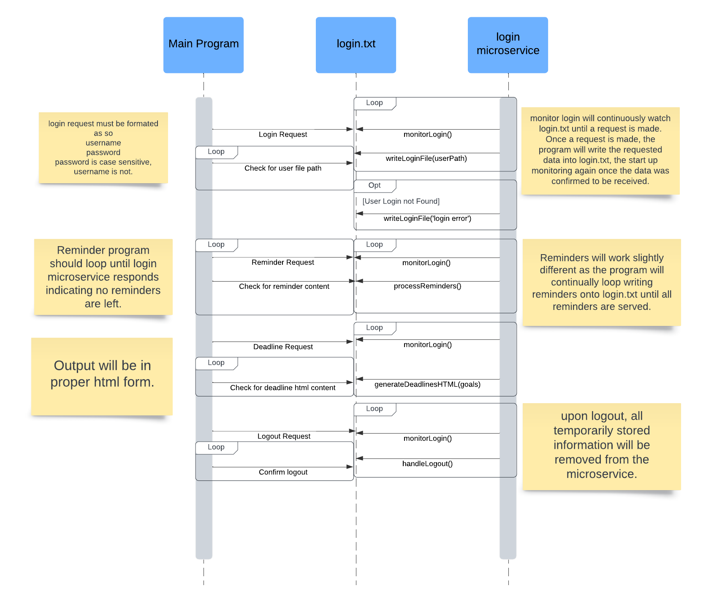

# Login and Reminder Microservice

This microservice provides a way to manage user login/logout requests, deadlines, and reminders via a shared text file (`login.txt`).

## How to Programmatically Request Data from the Microservice

To request data, you need to write specific commands to the `login.txt` file. Below are the available commands and their descriptions:

### Commands

1. **Login Request**
   - Write the username and password (separated by a newline) to `login.txt`.
   - Example:
     ```plaintext
     username
     password
     ```

2. **Request Deadlines**
   - Write `SEND_DEADLINES` to `login.txt`.
   - Example:
     ```plaintext
     SEND_DEADLINES
     ```

3. **Request Reminders**
   - Write `SEND_REMINDERS` to `login.txt`.
   - After each reminder, write `REMINDER_RECEIVED` to `login.txt` to proceed to the next one.
   - Example:
     ```plaintext
     SEND_REMINDERS
     ```

4. **Logout Request**
   - Write `LOGOUT` to `login.txt`.
   - Example:
     ```plaintext
     LOGOUT
     ```

---

## How to Programmatically Receive Data from the Microservice

The microservice writes responses back to `login.txt`. You need to monitor the file and read its content after sending a request.

### Responses

1. **Login Response**
   - If login is successful, the path to the userData (e.g., `/path/to/user/file.json`) is written to `login.txt`.
   - Example Response:
     ```plaintext
     /path/to/user/file.json
     ```

   - If login fails, `login error` is written to `login.txt`.
     ```plaintext
     login error
     ```

2. **Deadline Response**
   - Deadlines are returned in HTML format when requested.
   - Example Response:
     ```html
     <h1>Deadlines</h1>
     <ul>
         <li>12/25/2024 10:00 AM: Christmas Party</li>
         <li>01/01/2025 12:00 PM: New Year's Celebration</li>
     </ul>
     ```

3. **Reminder Response**
   - Reminders are returned one at a time in a two-line format. The first line is `REMINDER_MSG`, and the second line contains the reminder text.
   - Example Response:
     ```plaintext
     REMINDER_MSG
     Don't forget to submit your project!
     ```

   - When there are no reminders left, `NO_REMINDERS` is written to `login.txt`.
     ```plaintext
     NO_REMINDERS
     ```

4. **Logout Response**
   - After a successful logout, the message `LOGOUT_SUCCESSFUL` is written to `login.txt`.
     ```plaintext
     LOGOUT_SUCCESSFUL
     ```

---

## Additional information

- Users.json should contain all user login information with the following attributes: username, password, and pathway.
    - pathway should contain the file name of the user data
- User data should be stored in a JSON file that has each goal object with the following attributes: goalname, Priority, Reminders, Deadline, reminderSent.
    - reminder contains the content to be sent in reminders as discussed and reminderSent should indicate whether that reminder has already been sent or not.
- testProgram is just an example and should not be used as the main program for this microservice as it has no real functionality outside of making/receiving requests

---

## UML Sequence Diagram

The following diagram illustrates how requesting and receiving data works:



---

## Example Usage

Below is an example of how to programmatically interact with the microservice.

### Login Example (Request + Receive)
1. Write the login request to `login.txt`:
   ```plaintext
   username
   password

2. Recieve the pathway to the corresponding user from `login.txt`:
   ``` plaintext
   /path/to/user/file.json
   ```

3. Write `LOGIN_SUCCESSFUL` to login.txt
   ```plaintext
   LOGIN_SUCCESSFUL
   ```

4. Write `LOGOUT` to login.txt
   ```plaintext
   LOGOUT
   ```

This should result in a login attempt followed by a logout attempt.
